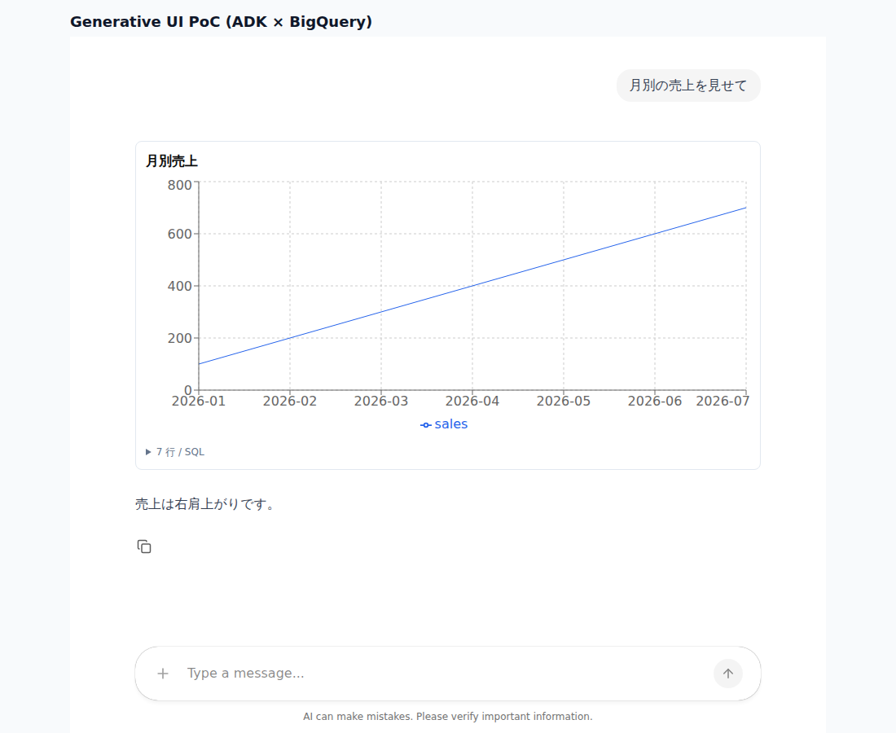

# Generative UI (ADK × BigQuery × CopilotKit)

自然言語の質問から BigQuery のデータを取得し、エージェントが選んだチャートを React の画面に描画する Generative UI の技術検証です。



## 構成

```
[ブラウザ] React + CopilotKit (v2) + Recharts          frontend/src
     │  HTTP
[Node]  Copilot Runtime                                frontend/server/runtime.mjs  :4000
     │  AG-UI (SSE)
[Python] FastAPI + ag-ui-adk                           server.py                    :8000
     └─ ui_agent (ADK v2)        チャートの種類と軸を決めて render_chart を呼ぶ
          └─ data_agent (ADK v2) 自然言語 → SQL → BigQueryToolset.execute_sql
                                                        │
                                                    [BigQuery]
```

| 層 | ライブラリ |
|---|---|
| エージェント | `google-adk[gcp]` 2.10 (`BigQueryToolset`) |
| エージェント ↔ フロントのプロトコル | `ag-ui-adk` 0.7 (AG-UI) |
| フロント | `@copilotkit/react-core` 1.74 (v2 API), `@copilotkit/runtime` 1.74 |
| チャート | `recharts` 3 |

### データの流れ (行データを LLM に通さない)

1. `data_agent` が `execute_sql` を実行する。
2. `data_agent/callbacks.py` の `stash_query_result` が全行を state (`query_result:<result_id>`) に保存し、LLM には `result_id`・カラム名・プレビュー5行だけを返す。
3. state の変更は AG-UI の `STATE_DELTA` イベントでフロントに届く。
4. `ui_agent` が `render_chart(chart_type, title, result_id, x_key, y_keys)` を呼ぶ。
   引数はバックエンドで Pydantic (`ChartSpec`) で検証し、エラー時は LLM が引数を直して再実行する。
5. フロントの `useRenderTool("render_chart")` がツール引数と state の行データから Recharts で描画する。

LLM が扱うのは「どのデータを、どのチャートで、どの軸に」という spec だけなので、トークン消費が行数に比例せず、数値が LLM によって書き換えられることもありません。

## セットアップ

```bash
# リポジトリ直下で Python 依存をインストール
uv sync
gcloud auth application-default login

# 環境変数
cp generative_ui/.env.example generative_ui/.env   # GOOGLE_CLOUD_PROJECT などを編集

# フロント
cd generative_ui/frontend && npm install
```

実行ユーザー (ADC) には以下の権限が必要です。

- Vertex AI ユーザー (`roles/aiplatform.user`)
- BigQuery ジョブユーザー (`roles/bigquery.jobUser`、課金先プロジェクト)
- BigQuery データ閲覧者 (`roles/bigquery.dataViewer`、対象データセット。公開データセットは不要)

## 実行

3つのプロセスを別々のターミナルで起動し、http://localhost:5173 を開きます。

```bash
# 1. エージェント (AG-UI エンドポイント)
cd generative_ui && uv run uvicorn server:app --port 8000

# 2. Copilot Runtime
cd generative_ui/frontend && npm run runtime

# 3. フロント
cd generative_ui/frontend && npm run dev
```

質問の例 (デフォルトのデータセット `bigquery-public-data.thelook_ecommerce`):

- 2024年の月別売上の推移を見せて
- 売上上位10カテゴリを比較したい
- 注文ステータスの構成比は？

エージェント単体の動作は ADK Web でも確認できます (チャートは描画されず、ツール呼び出しの内容だけが表示されます)。

```bash
uv run adk web generative_ui   # data_agent / ui_agent を選択
```

## テスト

```bash
uv run pytest generative_ui/tests      # Python (結果の退避、render_chart の検証)
cd generative_ui/frontend && npm run typecheck
```

## 設定

| 変数 | 説明 |
|---|---|
| `GOOGLE_CLOUD_LOCATION` | `global` を推奨。空いているリージョンに自動でルーティングされ、429 が出にくい |
| `GEMINI_MODEL` | 使用するモデル (既定: `gemini-2.5-flash`) |
| `BQ_DATASET` | エージェントに参照させるデータセット (`project.dataset`) |
| `BQ_COMPUTE_PROJECT_ID` | クエリの課金先プロジェクト (既定: `GOOGLE_CLOUD_PROJECT`) |
| `BQ_LOCATION` | データセットのロケーション |
| `VITE_ENABLE_INSPECTOR` | `true` で CopilotKit の開発用 Inspector を表示する |
| `COPILOTKIT_TELEMETRY_DISABLED` | `true` で Copilot Runtime の匿名テレメトリを止める |

安全のため、`data_agent/config.py` で以下を固定しています。

- `WriteMode.BLOCKED`: DDL / DML を拒否する
- `max_query_result_rows=1000`: 取得行数の上限
- `maximum_bytes_billed=1GB`: 1クエリあたりのスキャン上限
- 公開するツールは `list_table_ids` / `get_table_info` / `execute_sql` のみ

Gemini の呼び出しには、429 / 503 に対する指数バックオフのリトライ (最大5回) と、60秒のタイムアウトを設定しています。

## 既知の制約・次のステップ

- **Step 2: データエージェントの分離**
  `data_agent` を Agent Runtime (旧 Agent Engine) にデプロイし、`ui_agent` から A2A (`RemoteA2aAgent`) で呼ぶ構成に差し替える。
  その際、行データは A2A の構造化データで受け取り、state に移す処理が必要になる。
- **セッションはインメモリ**: `server.py` を再起動すると会話が消える。本番では `VertexAiSessionService` (Agent Engine Sessions) に切り替える。
- **ユーザーは固定**: `DEMO_USER_ID` を使っている。本番では認証情報から `user_id_extractor` で取り出す。
- **BigQuery のクエリにタイムアウトがない**: `execute_sql` にはジョブのタイムアウトを指定する設定がない。代わりに `maximum_bytes_billed` とエージェントのツールタイムアウト (180秒) で上限を設けている。
- **フロントのバンドルが大きい**: CopilotKit の Markdown / コードハイライトを含むため、ビルド後の JS が数 MB になる。
