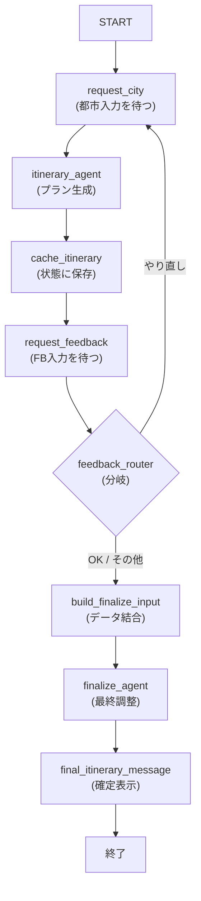

# Human-in-the-Loop 観光プランナー

人間の入力をワークフローの途中に挟み、必要に応じてプランを調整・再生成する **Human-in-the-Loop** パターンのサンプルです。
`RequestInput` による入力待ち、ループ構造、および `ctx.state` を利用したセッション跨ぎの状態管理を実証します。

## ワークフロー



## 主な機能と特徴

1. **ワークフローの一時停止 (`RequestInput`)**:
   - `yield RequestInput` を使用して、ユーザーが入力を終えるまで実行を一時停止します。
2. **状態管理 (`ctx.state`)**:
   - 途中で入力された都市名や生成されたプランをキャッシュし、ルーティング後の後続ノードで再利用します。
3. **動的ルーティング**:
   - ユーザーのフィードバック内容に応じて、最初からやり直すか、プランを確定させるかを動的に分岐させます。
4. **一貫したUIカード表示**:
   - Pydantic モデル (`Itinerary`) を出力スキーマに指定することで、ADK Web 上でリッチな情報カードを表示します。

## ディレクトリ構成

```
agents/
├── agent.py               # ワークフローのエッジ定義
├── prompts.py             # プロンプト・インストラクション
├── models/
│   └── itinerary.py       # 観光プランのデータ構造 (Pydantic)
├── subagents/
│   ├── itinerary.py       # 初期プラン生成エージェント
│   └── finalize.py        # 最終調整用エージェント
└── tools/
    ├── human_steps.py     # RequestInput を含むヒューマンステップ
    ├── router.py          # フィードバック内容に基づくルーティング
    └── cache.py           # 状態保存および最終メッセージ生成
```

## 実行方法

```bash
adk web human_in_the_loop_workflow
```
